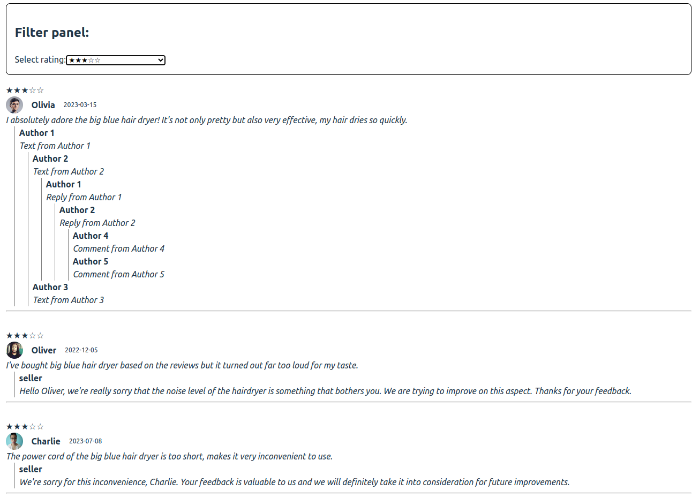

# FE Test application

## Description

This is a project to test your FE skill

## Installation

1. Clone this repo
2. Install dependencies: `npm i`

## Tasks

1. Blog
    - Run FE: `npm run blog:web:start`
    - Run BE: `npm run blog:api:start`
    - Visualize the data from the API in the WEB application, here is an example what is expected:

2. UT
    - Run UT in `npm run web:test`
    - Fix all errors

## Rules

1. You can use any library you want
2. You can change any code you want
3. You can add any code you want
4. You can add any file you want
